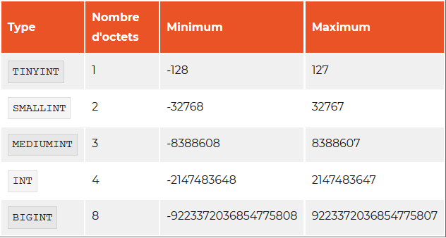

# MySQL_learn

## Entrer dans MySQL:   
`mysql -u root -p`  (exit ou quit : pour quiter l'invite de cmd)

## Commande qui permet la sélection de données, mais aussi l'affichage:
`SELECT '****';`

## Quelques autres caractères spéciaux :   
`\n`	:retour à la ligne  
`\t`	:tabulation   
`\ ou ''`(guillemet du haut)	:antislash  
`%` 	:pourcent (vous verrez pourquoi plus tard)  
`-` 	:souligné (vous verrez pourquoi plus tard aussi)  

## À chaque connexion à MySQL:   
`SET NAMES 'utf8';` 
# Types numériques  

## Nombres entiers  

## L'attribut UNSIGNED  

Vous pouvez également préciser que vos colonnes sont UNSIGNED, c'est-à-dire que l'on ne précise pas s'il s'agit d'une valeur positive ou négative (on aura donc toujours une valeur positive). Dans ce cas, la longueur de l'intervalle reste la même, mais les valeurs possibles sont décalées, le minimum valant 0. Pour les TINYINT, on pourra par exemple aller de 0 à 255.

## Limiter la taille d'affichage et l'attribut ZEROFILL

Il est possible de préciser le nombre de chiffres minimum à l'affichage d'une colonne de type INT(ou un de ses dérivés). Il suffit alors de préciser ce nombre entre parenthèses : INT(x). Notez bien que cela ne change pas les capacités de stockage dans la colonne. Si vous déclarez un INT(2), vous pourrez toujours y stocker 45282, par exemple. Simplement, si vous stockez un nombre avec un nombre de chiffres inférieur au nombre défini, le caractère par défaut sera ajouté à gauche du chiffre, pour qu'il prenne la bonne taille. Sans précision, le caractère par défaut est l'espace.    
Cette taille d'affichage est généralement utilisée en combinaison avec l'attribut ZEROFILL. Cet attribut ajoute des zéros à gauche du nombre lors de son affichage, il change donc le caractère par défaut par '0'. Donc si vous déclarez une colonne comme étant:  `INT(4) ZEROFILL` 

## Nombres décimaux

Cinq mots-clés permettent de stocker des nombres décimaux dans une colonne : `DECIMAL`, `NUMERIC`, `FLOAT`, `REAL`  et `DOUBLE.`

## NUMERIC et DECIMAL

`NUMERIC`  et `DECIMAL`  sont équivalents et acceptent deux paramètres : la précision et l'échelle.

* La précision définit le nombre de chiffres significatifs stockés, donc les 0 à gauche ne comptent pas. En effet, 0024 est équivalent à 24. Il n'y a donc que deux chiffres significatifs dans 0024.

 * L'échelle définit le nombre de chiffres après la virgule.

Dans un champ `DECIMAL(5,3)`, on peut donc stocker des nombres de 5 chiffres significatifs au maximum, dont 3 chiffres sont après la virgule. Par exemple : 12.354, -54.258, 89.2 ou -56.
`DECIMAL(4)`  équivaut à écrire `DECIMAL(4, 0)`.

## FLOAT, DOUBLE et REAL

Le mot-clé `FLOAT`  peut s'utiliser sans paramètres, auquel cas quatre octets sont utilisés pour stocker les valeurs de la colonne. Il est cependant possible de spécifier une précision et une échelle, de la même manière que pour `DECIMAL`  et `NUMERIC`.

Quant à `REAL`  et `DOUBLE`, ils ne supportent pas de paramètres. DOUBLE  est normalement plus précis que REAL  (stockage dans 8 octets, contre stockage dans 4 octets), mais ce n'est pas le cas avec `MySQL` qui utilise 8 octets dans les deux cas. Je vous conseille donc d'utiliser `DOUBLE`  pour éviter les surprises en cas de changement de SGBDR.

